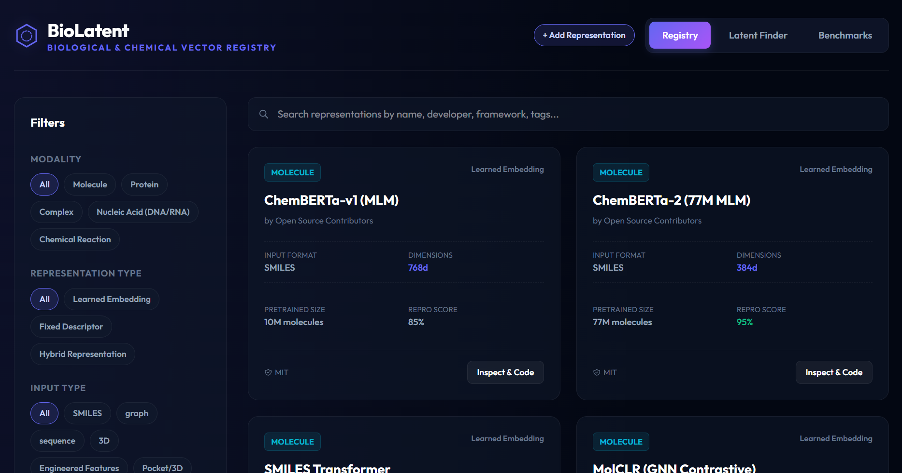

# BioLatent

An open-access registry, compatibility filter, and interactive benchmark dashboard for chemical and biological vector representations.

[](https://opensource.org/licenses/MIT)



---

## Overview

In computer-aided drug discovery and computational biology, the landscape of foundation models (molecules, proteins, nucleic acids) has expanded rapidly. However, comparing representation dimensions, data budgets, and downstream performance remains fragmented. 

**BioLatent** is a unified, provenance-aware index cataloging representations across five primary modalities: **Small Molecules**, **Proteins**, **Complexes**, **Chemical Reactions**, and **Nucleic Acids (DNA/RNA)**.

The website keeps two evidence surfaces separate. The **Literature Registry** transcribes values from source publications and explicitly warns that their protocols differ. The **Measured Benchmark** recomputes frozen embeddings under one local protocol and reports uncertainty, validation-selected paired comparisons, split sensitivity, and pretraining input-exposure proxies. Values from the two surfaces must not be mixed.

### Key Features
1. **Interactive Registry**: Browse, filter, and search representations by modality, licensing, pretraining sizes, and compute requirements.
2. **Compatibility Finder**: An objective catalog filter for modality, available input representation, and declared CPU/GPU profile. Results are alphabetical rather than ranked and must be validated on the user’s endpoint.
3. **Interactive Benchmark Chart**: A log-scale SVG scatter plot mapping embedding dimensions against standard benchmarks (MoleculeNet BBBP classification for molecules, and Q3 accuracy on CB513 for proteins).
4. **Curated Methods & Citations**: Collapsible details providing direct links to primary literature papers (e.g. TDC, MoleculeNet, FLIP).
5. **Programmatic JSON API**: Exposes query-parameter filters to fetch representation metadata dynamically (e.g. `/api/representations?modality=protein`).
6. **Reproducible Measured Study**: Imports public JSON artefacts produced by the benchmark scripts, with checkpoint revisions, dataset hashes, pooling, truncation, and software versions recorded in `results/run_manifest.json`.

---

## API Documentation

### GET `/api/representations`

Fetch all curated representations or filter them programmatically using query parameters.

#### Query Parameters
* `search` (string): Filters models by name, developer, or tags.
* `modality` (string): `molecule` | `protein` | `complex` | `reaction` | `nucleic_acid`
* `representationType` (string): `learned_embedding` | `fixed_descriptor` | `hybrid_representation`
* `inputRepresentation` (string): `SMILES` | `graph` | `sequence` | `3D` | `engineered_features` | `Pocket/3D` | `reaction_smiles`

#### Example Request
```bash
curl "https://biolatent.org/api/representations?modality=molecule&representationType=learned_embedding"
```

#### Example Response
```json
{
  "count": 1,
  "results": [
    {
      "id": "chemberta_77m",
      "name": "ChemBERTa-2 (77M MLM)",
      "representationType": "learned_embedding",
      "modality": "molecule",
      "inputRepresentation": "SMILES",
      "license": "MIT",
      "architectureType": "Transformer",
      "pretrainingObjective": "Masked Language Modeling (MLM) on SMILES tokens",
      "embeddingDimension": 384,
      "yearReleased": 2022,
      "trainingData": {
        "name": "PubChem10M / ZINC15",
        "size": "77M molecules",
        "license": "CC0 / Mixed"
      },
      "codeRepositoryUrl": "https://github.com/deepchem/deepchem",
      "weightsUrl": "https://huggingface.co/deepchem/ChemBERTa-77M-MLM",
      "computeProfile": "gpu",
      "benchmarks": [
        {
          "dataset": "BBBP (Blood-Brain Barrier)",
          "metric": "ROC-AUC",
          "score": "0.698",
          "citation": {
            "shortRef": "Ahmad et al., 2022",
            "doi": "https://doi.org/10.48550/arXiv.2209.01712",
            "note": "Table 1, MLM-77M, DeepChem scaffold split 80/10/10"
          }
        }
      ],
      "tags": ["BERT", "SMILES", "Transformers"],
      "codeSnippet": "..."
    }
  ]
}
```

---

## Local Development

1. **Install Dependencies**:
   ```bash
   npm install
   ```

2. **Run Development Server**:
   ```bash
   npm run dev
   ```

3. **Build Static & Dynamic Assets**:
   ```bash
   npm run build
   ```

---

## Reproducing the measured study

The raw datasets and embedding matrices are regenerated locally and are intentionally not committed. Public outputs in `results/` drive both the manuscript and website.

```bash
python benchmark/download_real_datasets.py
python benchmark/run_study.py --embeddings-only  # optional cache-only stage
python benchmark/run_study.py
python benchmark/paired_test.py
python benchmark/run_leakage.py --sample 150000
python benchmark/split_sensitivity.py
python benchmark/resolution_analysis.py
python benchmark/validate_release.py --full-hash
python paper/generate_manuscript.py
```

The final manuscript is written to `paper/BioLatent_methods_revised.docx`; the retained source template stays local.

MoLFormer requires its compatibility environment once:

```bash
bash benchmark/setup_molformer_env.sh /path/to/project/python
```

## Curation methodology

Registry metadata are descriptive catalog fields, not empirical quality or clinical-validation scores.

* **Artifact availability** records whether code and/or weights are linked; it is not a reproducibility score.
* **Compute profile** is the declared CPU, GPU, or mixed execution category, not a runtime guarantee.
* **Reported benchmarks** retain a source link and row-level provenance note. Values from heterogeneous papers are not treated as directly comparable.
* **Compatibility Finder** filters by modality, input format, and compute profile. It lists matches alphabetically and does not claim an optimal model.

---

## Citation

If you use BioLatent in your research, please cite:

```bibtex
@misc{boulaamane2026biolatent,
  title={What can a frozen-embedding benchmark resolve? A validation-selected, uncertainty-aware comparison of molecular, protein and genomic representations},
  author={Boulaamane, Yassir},
  year={2026},
  url={https://github.com/yboulaamane/biolatent}
}
```
